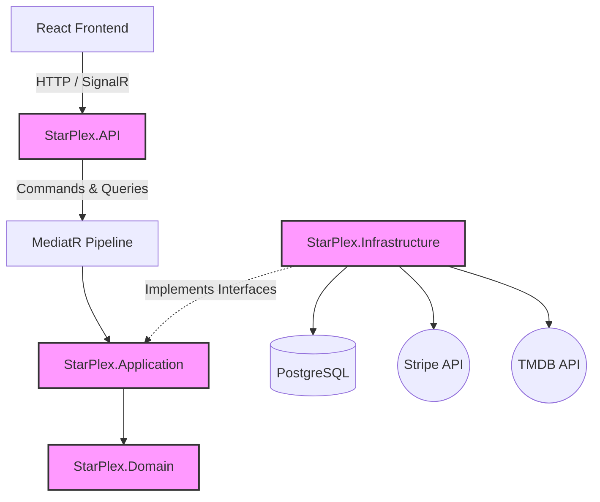

# 🍿 StarPlex Cinema Backend


> A production-ready cinema management and ticket booking API built with Clean Architecture, CQRS, and real-time seat locking.

## 🌟 Key Features
- **Real-Time Seat Booking:** SignalR integration with pessimistic concurrency control via PostgreSQL.
- **Payment Processing:** Secure Stripe integration with webhooks for asynchronous fulfillment.
- **External Movie Data:** TMDB API integration for rich movie metadata and posters.
- **Digital Tickets:** Automated PDF ticket generation with QR codes and email delivery (MailKit/QuestPDF).
- **Security:** JWT authentication and ASP.NET Core Identity with role-based access control (Admin, Cashier, Customer).

## 🏗️ Architecture Overview

The system strictly follows Clean Architecture principles, ensuring a separation of concerns and independent testability.



### 📂 Project Structure
- `StarPlex.Domain`: Core entities (Movie, Session, Booking, Seat, etc.) and enums. Contains no dependencies.
- `StarPlex.Application`: CQRS Handlers, interfaces, Validation (`FluentValidation`), and DTOs (`Mapster`).
- `StarPlex.Infrastructure`: EF Core DbContext, Identity, Stripe/TMDB services, SignalR hubs, Background workers.
- `StarPlex.API`: Controllers, Middleware (Exception handling returning RFC 7807 `ProblemDetails`), JWT Configuration, Swagger.

## ⚙️ Core Workflows

### Booking Flow
1. **Selection:** User selects a movie session.
2. **Real-Time Monitoring:** SignalR `SeatHub` connects to receive real-time seat availability updates.
3. **Seat Lock:** User selects a seat -> `PostgresSeatLockService` creates a temporary pessimistic lock (expires in 10 mins via `ExpiredLocksCleanupService`).
4. **Broadcast:** Other users instantly see the seat as 'Locked' via SignalR broadcast.

### Payment & Fulfillment Flow
1. **Initialization:** User confirms booking -> Backend creates a `PaymentIntent` via Stripe.
2. **Processing:** User pays securely on the frontend.
3. **Webhook Callback:** Stripe triggers an asynchronous webhook to `StripeWebhookController`.
4. **Fulfillment:** Backend validates the Stripe signature, finalizes the booking status, and generates PDF tickets embedded with QR codes.
5. **Delivery:** `EmailService` sends the tickets to the user via SMTP.

## 🚀 Getting Started

### Prerequisites
- .NET 8 SDK
- Docker Desktop (for Postgres & Mailpit)
- Stripe Account (Test Mode)
- TMDB API Key

### Local Setup
1. Clone the repository.
2. Run infrastructure containers (PostgreSQL & Mailpit):
   ```bash
   docker-compose up -d
   ```
3. Configure your local environment:
   - Use `.NET User Secrets` to configure your sensitive data like TMDB and Stripe API keys (see **Configuration** below for commands).
4. Apply database migrations:
   ```bash
   dotnet ef database update --project src/StarPlex.Infrastructure --startup-project src/StarPlex.API
   ```
5. Run the API:
   ```bash
   dotnet run --project src/StarPlex.API
   ```

## 🔐 Configuration
The repository uses safe placeholders in `appsettings.json`. For local development, sensitive configuration should be managed securely using **.NET User Secrets**.

1. Navigate to the API project directory:
   ```bash
   cd src/StarPlex.API
   ```
2. Initialize User Secrets (if not already initialized):
   ```bash
   dotnet user-secrets init
   ```
3. Set the required secrets:
   ```bash
   dotnet user-secrets set "ConnectionStrings:DefaultConnection" "Host=localhost;Database=starplex_db;Username=postgres;Password=super_secret_password_123"
   dotnet user-secrets set "JwtSettings:Secret" "your-super-secure-jwt-secret-key-12345"
   dotnet user-secrets set "TmdbSettings:ApiKey" "your_tmdb_api_key_here"
   dotnet user-secrets set "StripeSettings:SecretKey" "sk_test_..."
   dotnet user-secrets set "StripeSettings:PublishableKey" "pk_test_..."
   dotnet user-secrets set "StripeSettings:WebhookSecret" "whsec_..."
   ```

## 📚 API Documentation & Authentication
The API includes an interactive Swagger UI for testing endpoints.

1. Run the application in Development mode.
2. Navigate to `https://localhost:<port>/swagger` (or `http://localhost:<port>/swagger`).
3. To authenticate:
   - Use the `/api/users/login` endpoint to receive a JWT access token.
   - Click the **"Authorize"** button at the top of the Swagger UI.
   - Enter your token in the format: `Bearer <your_token>`.
   - Click **Authorize**. Future requests will automatically include the token in the `Authorization` header.

## ⚠️ Known Limitations
- The system currently uses pessimistic locking via PostgreSQL (`PostgresSeatLockService`) for seat reservations. This is sufficient for current traffic but could be migrated to a distributed lock manager like Redis if scaling to multiple backend instances becomes necessary.
