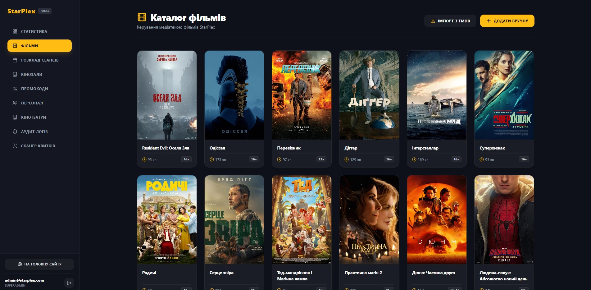
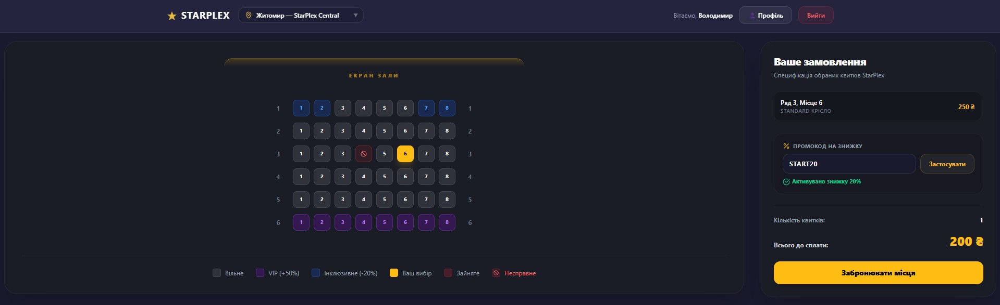
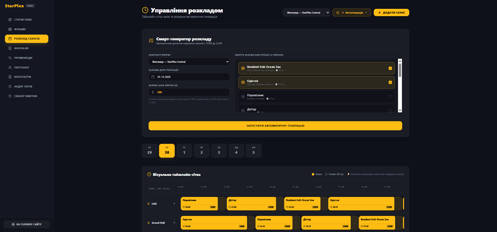
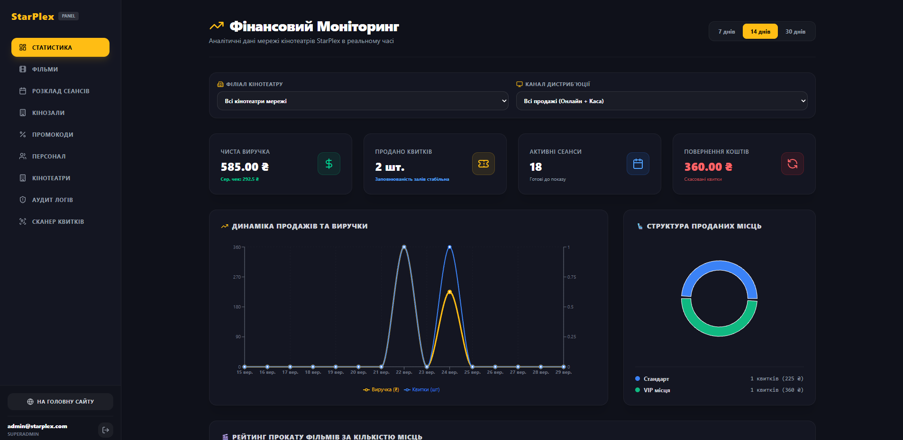

# StarPlex Cinema

A full-stack cinema booking and management application.
The backend is an ASP.NET Core 8 Web API following Clean Architecture and CQRS (MediatR).
The frontend is a React 19 SPA built with TypeScript, Vite, and Tailwind CSS.

Customers browse movies (sourced from TMDB), pick seats with real-time availability via SignalR, pay through Stripe, and receive PDF e-tickets by email.
Staff members manage sessions, scan tickets at the entrance, and handle walk-in sales.

## Live demo

**URL:** <https://starplex-web-dev.redtree-9d789217.polandcentral.azurecontainerapps.io>

The frontend and API run as separate Azure Container Apps with scale-to-zero enabled to reduce hosting costs. After a period of inactivity, the first visit may take longer: the frontend container starts first, and loading application data may then wait for the API container to start. If the first attempt shows a loading error, wait briefly and reload.

A public manager account is available for exploring staff features:

| Field    | Value                          |
|----------|--------------------------------|
| Email    | `demo.manager@starplex.example`|
| Password | `StarPlex-Demo!2026`           |
| Role     | CinemaManager                  |

Things to know about the demo environment:

- This is a shared environment. Changes you make (creating sessions, selling tickets, etc.) are visible to other visitors.
- The manager account is assigned to one cinema. Hall management, session scheduling, ticket scanning, and walk-in sales are scoped to that cinema. Movie management operates on the shared catalog visible to all cinemas.
- To try the customer booking and payment flow, register a separate customer account.
- The demo email address does not receive email; after a successful booking the tickets are available for download in the profile page.

### Suggested walkthrough

**Customer flow:**
Register a new account → browse the home page → open a movie → choose a session → select seats (they lock for 10 minutes) → proceed to payment → use Stripe test card `4242 4242 4242 4242` with any future expiry and any CVC → view the confirmed booking and download tickets from the profile page.

**Manager flow:**
Log in with the demo account → navigate to the admin panel → browse halls and their seat maps → create or edit a screening session → go to the cashier scanner page and scan a ticket QR code (or enter a ticket code manually).

Stripe is in test mode. No real money is charged. Use any [Stripe test card number](https://docs.stripe.com/testing#cards) to complete a payment.

## Screenshots

### Movie catalog



### Seat selection



### Screening schedule (manager panel)



### Cinema statistics (SuperAdmin)



Cinema statistics are available to SuperAdmin. This section is not accessible through the public demo manager account.

## Stack and technical decisions

### Backend

| Layer | Key libraries |
|---|---|
| Domain | Plain C# entities and enums, no external dependencies |
| Application | MediatR (CQRS), FluentValidation, Mapster |
| Infrastructure | EF Core 8 + Npgsql (PostgreSQL), ASP.NET Core Identity, Stripe.net, MailKit, QuestPDF, QRCoder, SignalR |
| API | Controllers, JWT authentication, Swagger, RFC 7807 ProblemDetails error middleware |

### Frontend

React 19, TypeScript, Vite, Tailwind CSS v4, Zustand (state), Axios, SignalR client, Stripe.js / React Stripe, html5-qrcode, Recharts, Lucide icons.

### Notable implementation details

**Seat reservation concurrency** — `PostgresSeatLockService` creates temporary seat reservations in the database inside an explicit transaction. It first checks for existing bookings and active locks by other users, then inserts new `SelectedSeat` rows with a 10-minute expiry. A unique index on `(SessionId, SeatId)` acts as a last-resort guard: if two concurrent requests pass the initial checks, the duplicate insert raises a PostgreSQL unique-violation error (SQLSTATE 23505), which the service catches and treats as a failed lock. A background service (`ExpiredLocksCleanupService`) runs periodically while the API is running to remove expired locks and cancel pending bookings whose Stripe PaymentIntent could be safely cancelled. Seat state changes are broadcast to other users through the SignalR `SeatHub`.

**Payment idempotency** — `CreatePaymentIntentAsync` accepts an optional idempotency key forwarded to Stripe. Refunds (`RefundPaymentAsync`) similarly support idempotency keys.

**Stripe webhook** — `StripeWebhookController` verifies the `Stripe-Signature` header against the configured webhook secret, then dispatches a `ConfirmBookingFromWebhookCommand` to finalize the booking.

**Ticket generation** — After payment confirmation, QuestPDF renders an A6-landscape PDF ticket containing movie details, seat info, and a QR code generated by QRCoder. The ticket is emailed via SMTP (MailKit) locally or Azure Communication Services in production.

**Authorization** — Four roles exist: `SuperAdmin`, `CinemaManager`, `Cashier`, `Customer`. Staff members (CinemaManager, Cashier) are scoped to a specific cinema. The frontend enforces route-level guards; the backend enforces `[Authorize(Roles = "...")]` on each controller action.

## Local setup

Docker Compose is the primary way to run the full application locally. It starts PostgreSQL, Mailpit (local email), the API, and the frontend.

### 1. Copy and fill the environment file

```bash
cp .env.example .env
```

Open `.env` and replace every `replace_me` placeholder:

| Variable | Purpose |
|---|---|
| `POSTGRES_PASSWORD` | PostgreSQL password |
| `JWT_SECRET` | Symmetric key for signing JWTs |
| `TMDB_API_KEY` | TMDB API key (get one at themoviedb.org) |
| `STRIPE_SECRET_KEY` | Stripe **test** secret key (`sk_test_...`) |
| `STRIPE_PUBLISHABLE_KEY` | Stripe **test** publishable key (`pk_test_...`) |
| `STRIPE_WEBHOOK_SECRET` | Stripe webhook signing secret (`whsec_...`) |
| `SEED_ADMIN_EMAIL` | Email for the initial SuperAdmin account |
| `SEED_ADMIN_PASSWORD` | Password for that account (min 8 chars, at least one digit) |

### 2. Start everything

```bash
docker compose up --build -d
```

On first startup the API container applies EF Core migrations automatically and seeds the four roles (`SuperAdmin`, `CinemaManager`, `Cashier`, `Customer`) plus the SuperAdmin account configured in `SEED_ADMIN_EMAIL` / `SEED_ADMIN_PASSWORD`.

After that, cinemas, halls, seats, movies, and sessions must be created manually through the SuperAdmin panel or API.

### 3. Access the services

| Service | URL |
|---|---|
| Frontend | <http://localhost:3000> |
| API | <http://localhost:5108> |
| API Swagger (Development) | <http://localhost:5108/swagger> |
| Mailpit web UI | <http://localhost:8025> |

In Docker Compose the frontend Nginx container proxies `/api`, `/uploads`, and `/hub` requests to the API container. The frontend does not need `VITE_BACKEND_URL` set locally because the default nginx.conf handles the routing.

### 4. Stripe webhooks for local development

To receive Stripe webhook events locally, use the [Stripe CLI](https://docs.stripe.com/stripe-cli):

```bash
stripe listen --forward-to http://localhost:5108/api/stripewebhook
```

Copy the webhook signing secret it prints and set it as `STRIPE_WEBHOOK_SECRET` in `.env`, then recreate the API container so it picks up the new value:

```bash
docker compose up -d --force-recreate api
```

Keep the Stripe CLI listener running in a separate terminal.

### Email

Locally, all email is captured by Mailpit — open <http://localhost:8025> to read it. In the deployed environment the application uses Azure Communication Services instead of SMTP.

## Tests and deployment

### Tests

The solution has three test projects:

- **StarPlex.Domain.UnitTests** — unit tests for domain logic.
- **StarPlex.Application.IntegrationTests** — integration tests using Testcontainers (PostgreSQL). Requires Docker to be running.
- **StarPlex.API.IntegrationTests** — integration tests for controller authorization, webhook handling, DI wiring, and role contracts.

Run all tests:

```bash
dotnet test StarPlex.sln
```

### CI/CD

Pull requests trigger the `CI` workflow (`ci.yml`), which builds the backend, runs all tests, builds the frontend, and verifies the production Nginx image.

Pushes to `main` trigger the `Deploy Dev` workflow (`deploy-dev.yml`), which re-runs CI, builds Docker images, pushes them to Azure Container Registry, and updates Azure Container Apps.

See [docs/ci-cd.md](docs/ci-cd.md) for details on OIDC authentication, repository variables, and the deployment verification step.

## Limitations

- The expired-booking cleanup service runs as a hosted `BackgroundService` inside the API process. It cancels a pending booking only when the corresponding Stripe PaymentIntent can be confirmed as cancelled. If Stripe is unreachable the booking stays in `Pending` state until the next cleanup cycle succeeds. When the API container is scaled to zero, the cleanup service is not running.
- The frontend Docker image bakes `VITE_BACKEND_URL` and `VITE_STRIPE_PUBLIC_KEY` at build time. Changing either value requires rebuilding the image.
